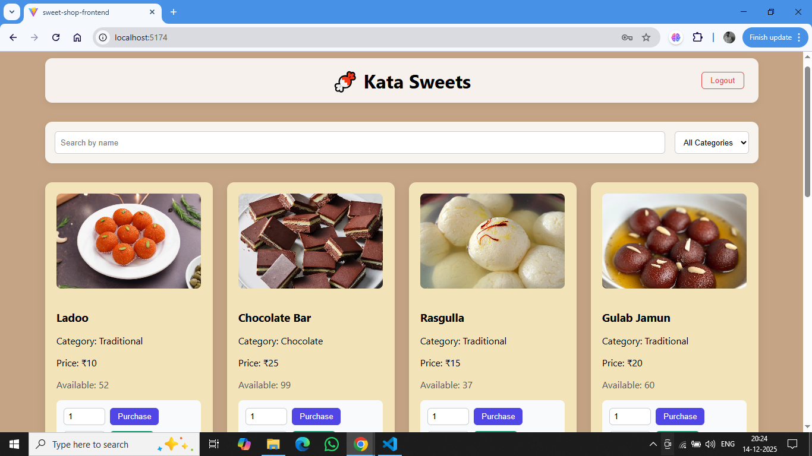
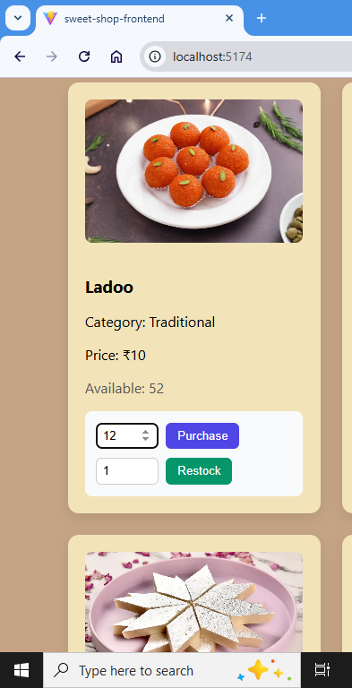

# 🍬 Sweet Shop Management System – Backend

This repository contains the backend implementation of the Sweet Shop Management System, developed as part of the Incubyte hiring assignment.

The backend focuses on core business logic, data persistence, and secure access control, while keeping the codebase clean, readable, and easy to extend.  
It is designed to function independently and exposes REST APIs that will be consumed by a frontend application.

## 🧱 Tech Stack

**Node.js** – Runtime environment

**TypeScript** – Type safety and maintainability

**Express.js** – HTTP server and routing

**Prisma ORM** – Database access and schema management

**SQLite** – Persistent file-based database

**JWT (JSON Web Tokens)** – Authentication and authorization

## 🗄️ Database & Persistence

The backend uses **Prisma ORM with SQLite** as the database.

SQLite is a real, persistent database — not an in-memory store. All data is stored in a file-based database (`dev.db`), which ensures:

- Data persists across server restarts  
- Inventory, users, and transactions are not lost when the application stops  
- The assignment requirement that in-memory storage is insufficient is fully satisfied  

Prisma was chosen so the database layer remains flexible. If needed, the same schema and logic can be migrated to PostgreSQL or another database with minimal changes.

## 📁 Project Structure
src/
├── app.ts                  # Express app configuration
├── server.ts               # Application entry point
│
├── config/
│   └── prisma.ts           # Prisma client instance
│
├── middleware/
│   ├── auth.middleware.ts  # JWT authentication middleware
│   └── role.middleware.ts  # Role-based authorization
│
├── modules/
│   ├── auth/               # Authentication module
│   │   ├── auth.controller.ts
│   │   ├── auth.service.ts
│   │   ├── auth.routes.ts
│   │   └── auth.test.ts
│   │
│   └── sweets/             # Sweets & inventory module
│       ├── sweets.controller.ts
│       ├── sweets.service.ts
│       └── sweets.routes.ts
│
├── types/
│   └── auth-request.ts     # Custom typed request interface
│
tests/
└── setup.ts                # Test setup and Prisma cleanup

The project follows a clear separation of concerns:

- **Routes** define endpoints and middleware  
- **Controllers** handle HTTP requests and responses  
- **Services** contain all business logic 

## 🔐 Authentication & Authorization

### Authentication
- Users can register and log in using email and password  
- Passwords are securely hashed  
- JWT tokens are issued upon successful authentication

### Authorization
- Role-based access control is enforced using middleware  
- Two roles are supported:
  - `USER`
  - `ADMIN`

Admin-only operations are explicitly protected to ensure inventory integrity.

## 🍬 Core Features

### 1. User Authentication
- User registration and login  
- JWT-based session handling  
- Secure password storage  

### 2. Sweet Inventory Management
- Add new sweets (ADMIN only)  
- List all sweets (public)  
- Search and filter sweets by name and/or category  

### 3. Purchase Sweets
- Authenticated users can purchase sweets  
- Available stock is validated before purchase  
- Quantity is reduced correctly after purchase  
- Over-purchase and invalid quantities are prevented  

### 4. Restock Sweets
- Admin-only operation  
- Increases inventory quantity  
- Prevents invalid restock values  

## 🌐 API Endpoints Overview

### Authentication
POST /api/auth/register
POST /api/auth/login

### Sweets
GET  /api/sweets
GET  /api/sweets?name=
GET  /api/sweets?category=

POST /api/sweets                 (ADMIN)
POST /api/sweets/:id/purchase    (USER / ADMIN)
POST /api/sweets/:id/restock     (ADMIN)

## 🧪 Testing Approach

- Core authentication flows are covered with automated tests  
- Tests interact with a real database via Prisma  
- Database state is reset between tests to ensure isolation  
- Manual end-to-end testing was performed using terminal-based API calls  

This approach ensures both correctness and realistic behavior.

## ⚙️ Setup & Running the Backend

### 1. Install dependencies

npm install

### 2. Configure environment variables

Create a .env file:

DATABASE_URL="file:./dev.db"
JWT_SECRET="your-secret-key"

### 3. Generate Prisma client
npx prisma generate

### 4. Start the server
npm run dev

The server runs at:

http://localhost:3000

## 🧪 Development & Testing Philosophy

The backend was developed using a test-driven mindset for critical flows, particularly around authentication and business logic.

For key features:

- Tests were written early to define expected behavior

- Failures helped surface issues related to validation, database state, and error handling

- Logic was refined until tests passed consistently

- Not every endpoint was developed strictly test-first, but tests were used intentionally where correctness and data integrity mattered most, such as authentication and inventory updates.

- This approach helped ensure predictable behavior while keeping development practical and focused.

## 🤖 My AI Usage

AI tools were used during the development of this project as assistive tools, not as replacements for design decisions or implementation ownership. The goal was to improve productivity, reduce friction, and validate approaches while retaining full control over the final solution.

### AI Tools Used

- ChatGPT (OpenAI)

No other AI tools (such as GitHub Copilot or Gemini) were used for this project.

### How I Used AI

I primarily used ChatGPT as a development assistant in the following ways:

- Clarifying requirements and edge cases
I used AI to reason through business rules such as purchase constraints, stock validation, and role-based access control to ensure no important edge cases were missed.

- Discussing API design and structure
I used it to validate REST endpoint structure and request/response behavior, similar to how one might discuss an approach with a teammate.

- Debugging and understanding errors
When encountering TypeScript or Prisma-related errors, I used AI to understand why certain issues occurred and to explore type-safe solutions. The final fixes were applied manually after understanding the root cause.

- Improving documentation quality
AI was used to help structure and refine the README so that the explanation of the system, database choice, and testing approach was clear and readable.

- Importantly, all implementation decisions, code structure, and final logic were written, reviewed, and validated by me. Code was frequently adjusted, refactored, or corrected after testing and manual verification.

### Reflection on AI Impact

Using AI significantly improved development efficiency, especially when working through unfamiliar error messages or validating design decisions quickly. It helped reduce context-switching and allowed me to focus more on business logic and correctness rather than syntax or boilerplate.

**AI output was treated as suggestions, not authoritative answers.** Several cases required deeper investigation, testing, and iteration before arriving at the correct solution. This reinforced the importance of understanding the system rather than blindly accepting generated responses.

Overall, AI acted as a supporting tool, similar to documentation or peer discussion, while responsibility for the final implementation, correctness, and design remained entirely mine.

# 🍬 Sweet Shop Management System – Frontend 

This repository contains the frontend implementation of the Sweet Shop Management System, built as part of the Incubyte hiring assignment.

The frontend focuses on usability, clean UI, role-aware interactions, and seamless integration with the backend APIs. While the design is intentionally minimal, care has been taken to ensure the interface feels polished, intuitive, and professional.

## 🎯 Purpose of the Frontend

The frontend serves as the user-facing layer of the application and is responsible for:

- User authentication (login & registration)

- Browsing, searching, and filtering sweets

- Purchasing sweets as a user

- Managing inventory (restocking) as an admin

- Displaying real-time data from the backend

All business rules (stock validation, permissions, etc.) are enforced by the backend, while the frontend focuses on presentation, interaction, and user experience.

## 🧱 Tech Stack

**React (TypeScript)** – Component-based UI with strong type safety

**Vite** – Fast development server and modern build tooling

**React Router** – Client-side routing and protected routes

**Fetch API** – Backend communication

**Context API** – Authentication state management

**CSS (inline + global styles)** – Lightweight styling without heavy UI libraries

No component libraries were used intentionally, to keep the UI custom, understandable, and easy to reason about.

## Project Structure

sweet-shop-frontend/
├── public/
│   └── vite.svg
│
├── screenshots/                 # Screenshots for live project
│   ├── admin-restock.png
│   ├── admin-sweets-card.png
│   ├── homepage.png
│   ├── invalid-purchase.png
│   ├── login-page.png
│   ├── purchase-successful.png
│   ├── purchase.png
│   ├── purchase-successful.png
│   ├── register-page.png
│   ├── search-filter-working.png
│   └── search-filter.png
│
├── src/
│   ├── api/
│   │   ├── auth.api.ts          # Login & registration API calls
│   │   └── sweets.api.ts        # Sweets, purchase & restock API calls
│   │
│   ├── assets/
│   │   └── sweets/              # Sweet images (webp, jpg, jfif)
│   │       ├── ladoo.webp
│   │       ├── barfi.webp
│   │       ├── brownie.jfif
│   │       ├── donut.webp
│   │       ├── gulab-jamun.webp
│   │       └── default.jpg
│   │
│   ├── components/
│   │   ├── ProtectedRoute.tsx   # Route guard for authenticated users
│   │   └── SweetCard.tsx        # Individual sweet display card
│   │
│   ├── context/
│   │   └── AuthContext.tsx      # Authentication context provider
│   │
│   ├── hooks/
│   │   └── useAuth.ts           # Custom auth hook
│   │
│   ├── pages/
│   │   ├── Login.tsx            # Login page
│   │   ├── Register.tsx         # User registration page
│   │   └── Sweets.tsx           # Main sweets listing page
│   │
│   ├── utils/
│   │   ├── sweetImages.ts       # Sweet → image mapping logic
│   │   └── token.ts             # Token storage helpers
│   │
│   ├── types/
│   │   └── index.ts             # Shared TypeScript types
│   │
│   ├── App.tsx                  # App routes and layout
│   ├── App.css                  # App-level styles
│   ├── index.css                # Global styles
│   └── main.tsx                 # Application entry point
│
├── eslint.config.js              # ESLint configuration
├── .gitignore
├── index.html
├── package.json
├── package-lock.json
├── tsconfig.json
├── tsconfig.app.json
├── tsconfig.node.json
├── vite.config.ts
└── README.md

## 🎨 UI & Design Philosophy

The UI follows a clean and minimal design approach:

- Soft background colors to avoid visual clutter
- Card-based layout for sweets
- Clear call-to-action buttons (Purchase, Restock)
- Visual distinction between user and admin capabilities
- Responsive grid layout for better use of screen space

Design decisions were guided by:

- Readability over decoration
- Clarity over complexity
- Functionality first, aesthetics second

## 🔐 Authentication Flow

### Login

Users log in using email and password
- On successful login:
- JWT token is stored securely in local storage 
- User is redirected to the main sweets page
- Invalid credentials are handled gracefully with error messages

### Registration

New users can create an account from the Login page

After successful registration:
- The user is automatically logged in
- No manual re-login is required

### Logout

- Available from the top navigation bar
- Clears authentication state and redirects to login

## 🧠 Role-Based UI Behavior

The frontend adapts based on the user’s role, decoded from the JWT:

### USER

- Can view sweets
- Can search and filter
- Can purchase sweets (if stock is available)

### ADMIN

- All USER capabilities
- Can restock sweets directly from the UI
- Restock controls are visible only to admins

This ensures:

- No accidental exposure of admin features
- Clear separation of responsibilities in the UI

## 🍬 Sweets Listing & Interaction

### Features

- Responsive grid layout for sweets
- Each sweet card displays:
- Image
- Name
- Category
- Price
- Available quantity
- Quantity input for purchase/restock
- Success and error feedback messages per action
- Search & Filter
- Search by sweet name
- Filter by category
- Filters are applied dynamically and reflected immediately

## 🖼️ Images & Assets

Each sweet displays a relevant image when available

Images are mapped intelligently based on:

- Sweet name
- Category
- A fallback image is used when no specific match exists

This keeps the UI visually engaging while avoiding hard dependencies on backend data.

## 🌐 Backend Integration

The frontend communicates with the backend via REST APIs:

- Base API URL is configured using environment variables
- All protected actions include JWT in the Authorization header
- API failures are handled with user-friendly messages
- The frontend assumes the backend is running locally during development.

## ⚙️ Setup & Running the Frontend Locally

1. Install dependencies
- npm install

2. Configure environment variables

Create a .env file in the root:

- VITE_API_BASE_URL=http://localhost:3000/api

Ensure the backend server is running before starting the frontend.

3. Start the development server
- npm run dev

The application will be available at:

- http://localhost:5173

## 🧪 Manual Testing

The frontend was tested manually by:

- Logging in as both USER and ADMIN
- Verifying role-specific UI behavior
- Purchasing sweets with valid and invalid quantities
- Restocking sweets as admin
- Testing search and filter combinations
- Verifying UI updates after API actions

This ensured realistic, end-to-end behavior when integrated with the backend.

## 🤖 My AI Usage (Frontend)

### AI Tools Used

- ChatGPT (OpenAI)

No other AI tools (such as GitHub Copilot or Gemini) were used for this project.

### How I Used AI

AI was used as a development assistant, primarily for:

- Discussing UI layout ideas and improvements
- Debugging React, TypeScript, and styling issues
- Validating role-based rendering logic
- Refining README documentation for clarity and structure

**AI was not used to blindly generate the UI. All components were:**

- Written manually
- Iterated visually
- Tested against real backend behavior

### Reflection on AI Impact

AI helped speed up development by reducing trial-and-error, especially during debugging and layout refinements. However, all architectural decisions, UI behavior, and integration logic were implemented and validated by me.

AI functioned as a productivity tool, similar to documentation or peer discussion, not as a replacement for problem-solving.

## 🖼️ Screenshots

### Login Page

### User Registration

### Home – Sweet Listings

### Sweet Grid Layout

### Search & Filter

### Search & Filter Working

### Purchase Flow

### Purchase Flow Successful

### Admin – Restock Inventory

### Admin – Restock Inventory Successful

### Invalid Purchase

